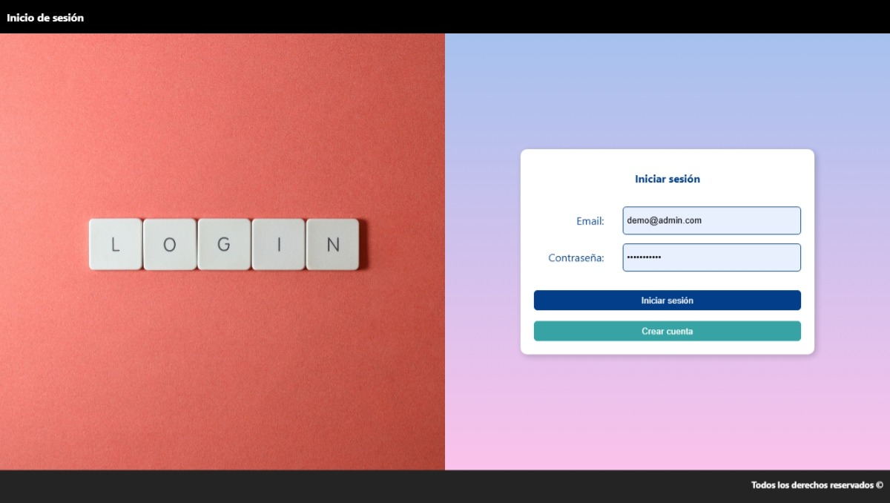
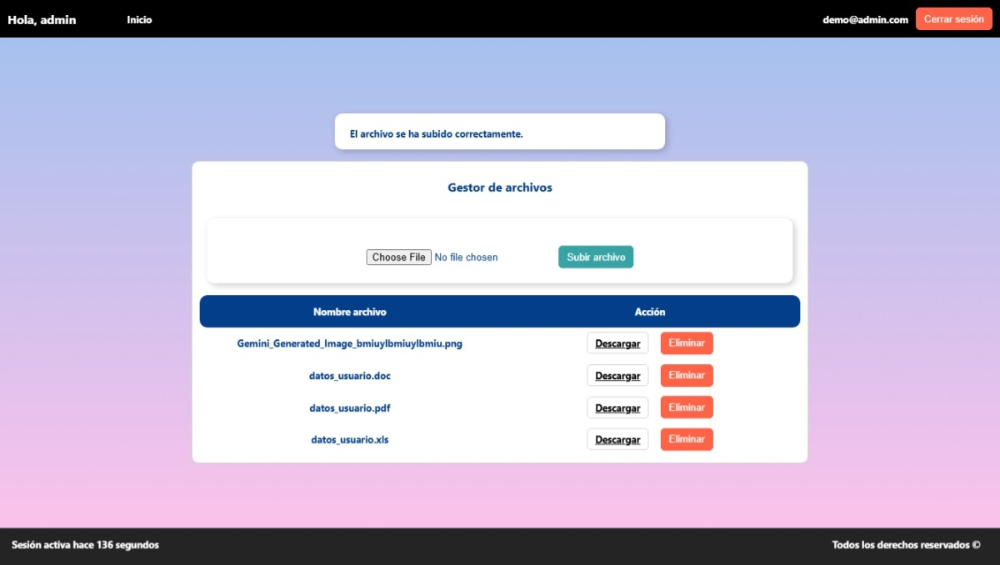

# Portfolio de Proyectos de Programación Web

Este repositorio contiene una colección de proyectos desarrollados para el aprendizaje y práctica de tecnologías web, incluyendo PHP, HTML, CSS, JavaScript y frameworks como CodeIgniter.

## 📋 Tabla de Contenidos

- [Proyectos Backend PHP](#-proyectos-backend-php)
- [Proyectos Frontend](#-proyectos-frontend)
- [Actividades de Aprendizaje 2024](#-actividades-de-aprendizaje-2024)
- [Proyectos CSS Grid y Flexbox](#-proyectos-css-grid-y-flexbox)
- [Instrucciones de Instalación](#-instrucciones-de-instalación)
- [Tecnologías Utilizadas](#-tecnologías-utilizadas)

---

## 🚀 Proyectos Backend PHP

### 1. Sistema de Login con Gestión de Archivos (2-3-actividad-integradora)
**Ubicación:** `2-3-actividad-integradora/`

Sistema completo de autenticación de usuarios con funcionalidades avanzadas de gestión de archivos.

**Características:**
- ✅ Sistema de login/registro con cookies
- ✅ Gestión de sesiones PHP
- ✅ Subida y descarga de archivos
- ✅ Eliminación de archivos
- ✅ Validación de usuarios
- ✅ Interfaz responsiva

**Tecnologías:** PHP, HTML, CSS, JavaScript, Cookies, File Management

**Vistas disponibles:**
-  *Pantalla de inicio de sesión*

---

### 2. Sistema Avanzado con Generación de Documentos (3-3-archivos-formato-word-excel-pdf)
**Ubicación:** `3-3-archivos-formato-word-excel-pdf/`

Sistema profesional con Docker, generación de documentos PDF, Word, Excel e imágenes desde datos JSON.

**Características:**
- ✅ Autenticación con archivos JSON
- ✅ Generación automática de documentos PDF usando TCPDF
- ✅ Creación de archivos Word y Excel
- ✅ Generación de imágenes PNG
- ✅ Sistema de archivos por usuario
- ✅ Contenedor Docker para desarrollo
- ✅ Composer para gestión de dependencias

**Tecnologías:** PHP, JSON, TCPDF, Docker, Composer, File System

**Vistas disponibles:**
-  *Pantalla de login*
-  *Panel de administración*

**Para ejecutar:**
```bash
cd 3-3-archivos-formato-word-excel-pdf/
docker compose up --build
# Acceder a: http://localhost:8000
```

---

### 3. Actividad Integradora - Respuestas PHP (3-4-actividad-integradora-respuestas-php)
**Ubicación:** `3-4-actividad-integradora-respuestas-php/`

Proyecto de integración que combina múltiples funcionalidades PHP con generación de documentos.

**Características:**
- ✅ Sistema de login con JSON
- ✅ Generación de documentos Word, Excel, PDF e imágenes
- ✅ Funciones personalizadas para conversión de formatos
- ✅ Gestión de sesiones y cookies
- ✅ Interfaz de usuario intuitiva

**Tecnologías:** PHP, JSON, TCPDF, GD Library (imágenes)

---

### 4. Aplicación MVC con CodeIgniter 4 (4-3-desarrollo-aplicacion-con-mvc)
**Ubicación:** `4-3-desarrollo-aplicacion-con-mvc/`

Aplicación completa siguiendo el patrón Modelo-Vista-Controlador con CodeIgniter 4.

**Características:**
- ✅ Framework CodeIgniter 4
- ✅ Arquitectura MVC completa
- ✅ Sistema de migraciones de base de datos
- ✅ Testing con PHPUnit
- ✅ Configuración de múltiples entornos
- ✅ Sistema de logs y debugging

**Tecnologías:** CodeIgniter 4, PHP, MySQL, PHPUnit, Composer

---

### 5. Gestión de Sesiones y Cookies (4-4-manejo-usuario-sesiones-y-cookies)
**Ubicación:** `4-4-manejo-usuario-sesiones-y-cookies/`

Aplicación enfocada en la gestión avanzada de sesiones y cookies con CodeIgniter.

**Características:**
- ✅ Manejo avanzado de sesiones
- ✅ Sistema de cookies personalizadas
- ✅ Persistencia de datos de usuario
- ✅ Validación de sesiones activas
- ✅ Seguridad en la gestión de estado

**Tecnologías:** CodeIgniter 4, PHP, Sessions, Cookies

---

### 6. Actividad Integradora MVC (4-5-actividad-integradora-modelo-vista-controlador)
**Ubicación:** `4-5-actividad-integradora-modelo-vista-controlador/`

Proyecto integrador que demuestra el uso completo del patrón MVC.

**Características:**
- ✅ Implementación completa del patrón MVC
- ✅ Controladores y modelos organizados
- ✅ Vistas dinámicas con layouts
- ✅ Rutas y navegación estructurada
- ✅ Validaciones y seguridad

**Tecnologías:** CodeIgniter 4, PHP, MVC Pattern

---

## 🎨 Proyectos Frontend

### 7. Formularios y Estructuras de Datos (formularios-y-estructuras-de-datos)
**Ubicación:** `formularios-y-estructuras-de-datos/`

Aplicación para manejo de formularios y estructuras de datos en PHP.

**Características:**
- ✅ Procesamiento de formularios complejos
- ✅ Manejo de arrays y estructuras de datos
- ✅ Validación del lado del servidor
- ✅ Retroalimentación visual al usuario

**Tecnologías:** PHP, HTML, CSS

---

### 8. Comunicación Cliente-Servidor (comunicacion-entre-cliente-servidor)
**Ubicación:** `comunicacion-entre-cliente-servidor/`

Demostración de comunicación entre frontend y backend.

**Características:**
- ✅ Envío y recepción de datos
- ✅ Procesamiento de respuestas del servidor
- ✅ Manejo de errores de comunicación
- ✅ Interfaz de usuario responsiva

**Tecnologías:** PHP, HTML, JavaScript, AJAX

---

### 9. Configuración de Sesiones (configurando-y-operando-inicio-sesion)
**Ubicación:** `configurando-y-operando-inicio-sesion/`

Sistema básico de configuración y operación de sesiones.

**Características:**
- ✅ Configuración inicial de sesiones
- ✅ Persistencia de datos de usuario
- ✅ Validación de acceso
- ✅ Interfaz de login simple

**Tecnologías:** PHP, HTML, CSS, Sessions

**Vistas disponibles:**
-  *Pantalla de login*

---

### 10. Estructuras y Arrays en PHP (estructuras-y-arreglos-en-php)
**Ubicación:** `estructuras-y-arreglos-en-php/`

Proyecto educativo sobre manejo de estructuras de datos en PHP.

**Características:**
- ✅ Manipulación de arrays
- ✅ Estructuras de datos complejas
- ✅ Procesamiento y transformación de datos
- ✅ Visualización de resultados

**Tecnologías:** PHP, HTML, CSS

---

## 📚 Actividades de Aprendizaje 2024

**Ubicación:** `actividades-2024/`

Colección de actividades prácticas para el aprendizaje de tecnologías web frontend.

### 1. Obteniendo Elementos HTML (1-2-obteniendo-elementos-html)
- ✅ Manipulación del DOM
- ✅ Formularios dinámicos
- ✅ Validación de formularios con JavaScript
- ✅ Estilos CSS personalizados

### 2. Creación de Elementos Dinámicos (1-3-creacion-elementos-dinamicos)
- ✅ Creación dinámica de elementos HTML
- ✅ JavaScript avanzado
- ✅ Manipulación del DOM en tiempo real

### 3. Eventos de Forma Dinámica (1-4-agregacion-eventos-forma-dinamica)
- ✅ Gestión de eventos
- ✅ Interactividad avanzada
- ✅ Listeners de eventos personalizados

### 4. Objetos y JSON (2-2-objetos-y-json)
- ✅ Manejo de objetos JavaScript
- ✅ Conversión JSON bidireccional
- ✅ Tablas dinámicas desde datos
- ✅ Formularios de creación de objetos

### 5. Funciones Asíncronas (2-3-funciones-asincronas)
- ✅ Programación asíncrona
- ✅ Promesas y async/await
- ✅ Manejo de respuestas asíncronas

### 6. AJAX y Fetch API (2-4-ajax-fetch-api)
- ✅ Peticiones AJAX
- ✅ API Fetch de JavaScript
- ✅ Consumo de servicios web
- ✅ Manejo de respuestas JSON

---

## 🎯 Proyectos CSS Grid y Flexbox

### 1. Grid Avanzado (grid-avanzado)
**Ubicación:** `grid-avanzado/`

Implementación avanzada de CSS Grid para layouts complejos.

**Características:**
- ✅ Grid areas definidas
- ✅ Layout responsivo
- ✅ Distribución inteligente del contenido
- ✅ Diseño profesional con header, nav, main, aside y footer

**Tecnologías:** HTML, CSS Grid

### 2. Introducción a Grid (intro-grid)
**Ubicación:** `intro-grid/`

Introducción básica a los conceptos de CSS Grid.

**Características:**
- ✅ Grid básico
- ✅ Propiedades fundamentales
- ✅ Layout estructurado

**Tecnologías:** HTML, CSS Grid

### 3. Web Responsivo con Flexbox y Grid (web-responsivo-flex-grid)
**Ubicación:** `web-responsivo-flex-grid/`

Diseño web completamente responsivo combinando Flexbox y Grid.

**Características:**
- ✅ Diseño adaptativo
- ✅ Combinación de Flexbox y Grid
- ✅ Media queries para diferentes dispositivos
- ✅ Layout fluido y moderno

**Tecnologías:** HTML, CSS, Flexbox, Grid

### 4. Sitio de Noticias (noticias)
**Ubicación:** `noticias/`

Layout para sitio de noticias usando técnicas CSS modernas.

**Características:**
- ✅ Distribución de contenido periodístico
- ✅ Diseño limpio y legible
- ✅ Organización visual de información

**Tecnologías:** HTML, CSS

---

## 🛠️ Instrucciones de Instalación

### Requisitos Previos
- **PHP** 7.4 o superior
- **Composer** (para proyectos que lo requieren)
- **Docker** (opcional, para proyectos containerizados)
- **Servidor web** (Apache/Nginx) o PHP Built-in server

### Configuración General

1. **Clonar el repositorio:**
```bash
git clone <url-del-repositorio>
cd freelance-work-elvia
```

2. **Para proyectos con Docker:**
```bash
cd 3-3-archivos-formato-word-excel-pdf/
docker compose up --build
```

3. **Para proyectos PHP estándar:**
```bash
# Usar servidor built-in de PHP
php -S localhost:8000

# O configurar con Apache/Nginx
```

4. **Instalar dependencias (donde aplique):**
```bash
composer install
```

---

## 💻 Tecnologías Utilizadas

### Backend
- **PHP** 7.4/8.2
- **CodeIgniter 4** - Framework MVC
- **Composer** - Gestión de dependencias
- **TCPDF** - Generación de PDFs
- **Docker** - Containerización

### Frontend
- **HTML5** - Estructura semántica
- **CSS3** - Grid, Flexbox, Media Queries
- **JavaScript (ES6+)** - DOM, AJAX, Fetch API
- **JSON** - Intercambio de datos

### Base de Datos
- **MySQL** (en proyectos MVC)
- **JSON Files** (sistemas de archivos)
- **Cookies** (persistencia de sesión)

### Herramientas de Desarrollo
- **Docker & Docker Compose**
- **PHPUnit** (testing)
- **Git** (control de versiones)

---

## 📈 Progreso y Características

### ✅ Completado
- Sistemas de autenticación completos
- Generación de documentos (PDF, Word, Excel)
- Aplicaciones MVC con CodeIgniter
- Interfaces responsivas
- Gestión de sesiones y cookies
- Manipulación avanzada del DOM
- Peticiones AJAX y Fetch
- Layouts con CSS Grid y Flexbox

### 🚧 En Desarrollo
- Optimización de rendimiento
- Testing automatizado
- Documentación API
- Internacionalización

---

## 📝 Notas

- Todos los proyectos incluyen interfaces en español
- Los sistemas de login están funcionales con validación de usuarios
- Los proyectos Docker incluyen archivos de configuración completos
- Se utilizan prácticas de seguridad básicas (validación, sanitización)
- Los diseños son responsivos y adaptativos

---

*Este portfolio demuestra el progreso en el aprendizaje de tecnologías web full-stack, desde conceptos básicos hasta aplicaciones complejas con frameworks modernos.*
